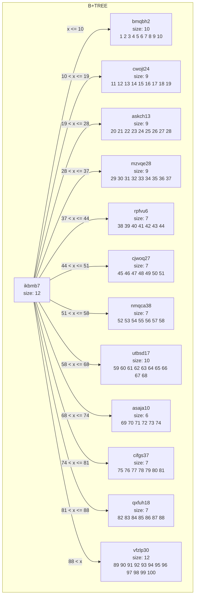

```mermaid
graph TD
subgraph B+TREE
ikbmb7[ikbmb7<br/>size: 12<br/>]
bmqbh2[bmqbh2<br/>size: 10<br/>1 2 3 4 5 6 7 8 9 10 ]
ikbmb7-->|x <= 10|bmqbh2
cwojt24[cwojt24<br/>size: 9<br/>11 12 13 14 15 16 17 18 19 ]
ikbmb7-->|10 < x <= 19|cwojt24
askch13[askch13<br/>size: 9<br/>20 21 22 23 24 25 26 27 28 ]
ikbmb7-->|19 < x <= 28|askch13
mzvqe28[mzvqe28<br/>size: 9<br/>29 30 31 32 33 34 35 36 37 ]
ikbmb7-->|28 < x <= 37|mzvqe28
rpfvu6[rpfvu6<br/>size: 7<br/>38 39 40 41 42 43 44 ]
ikbmb7-->|37 < x <= 44|rpfvu6
cjwoq27[cjwoq27<br/>size: 7<br/>45 46 47 48 49 50 51 ]
ikbmb7-->|44 < x <= 51|cjwoq27
nmqca38[nmqca38<br/>size: 7<br/>52 53 54 55 56 57 58 ]
ikbmb7-->|51 < x <= 58|nmqca38
utbsd17[utbsd17<br/>size: 10<br/>59 60 61 62 63 64 65 66 67 68 ]
ikbmb7-->|58 < x <= 68|utbsd17
asaja10[asaja10<br/>size: 6<br/>69 70 71 72 73 74 ]
ikbmb7-->|68 < x <= 74|asaja10
cifgs37[cifgs37<br/>size: 7<br/>75 76 77 78 79 80 81 ]
ikbmb7-->|74 < x <= 81|cifgs37
qxfuh18[qxfuh18<br/>size: 7<br/>82 83 84 85 86 87 88 ]
ikbmb7-->|81 < x <= 88|qxfuh18
vfzlp30[vfzlp30<br/>size: 12<br/>89 90 91 92 93 94 95 96 97 98 99 100 ]
ikbmb7-->|88 < x|vfzlp30
end
```

```mermaid
graph LR
subgraph UNORDERED_HEAP
nwlrb1[nwlrb1<br/>size: 4<br/>93 52 12 70 ]
jmwwd3[jmwwd3<br/>size: 4<br/>25 36 18 37 ]
nwlrb1-->jmwwd3
chiis4[chiis4<br/>size: 4<br/>27 99 68 40 ]
jmwwd3-->chiis4
svnjh5[svnjh5<br/>size: 4<br/>84 3 76 57 ]
chiis4-->svnjh5
rwilj8[rwilj8<br/>size: 4<br/>60 19 33 41 ]
svnjh5-->rwilj8
pxxnt9[pxxnt9<br/>size: 4<br/>92 87 58 13 ]
rwilj8-->pxxnt9
udxhn11[udxhn11<br/>size: 4<br/>15 43 28 63 ]
pxxnt9-->udxhn11
faeky12[faeky12<br/>size: 4<br/>64 59 31 97 ]
udxhn11-->faeky12
lvduh14[lvduh14<br/>size: 4<br/>14 69 4 88 ]
faeky12-->lvduh14
plema15[plema15<br/>size: 4<br/>72 65 10 23 ]
lvduh14-->plema15
xnszy16[xnszy16<br/>size: 4<br/>67 81 21 80 ]
plema15-->xnszy16
dvznz19[dvznz19<br/>size: 4<br/>90 82 74 1 ]
xnszy16-->dvznz19
ibumx20[ibumx20<br/>size: 4<br/>95 42 89 29 ]
dvznz19-->ibumx20
bbkfp21[bbkfp21<br/>size: 4<br/>53 44 17 61 ]
ibumx20-->bbkfp21
keedd22[keedd22<br/>size: 4<br/>50 8 85 73 ]
bbkfp21-->keedd22
cxzgr23[cxzgr23<br/>size: 4<br/>30 62 7 46 ]
keedd22-->cxzgr23
xnoxc25[xnoxc25<br/>size: 4<br/>54 77 9 34 ]
cxzgr23-->xnoxc25
nhfht26[nhfht26<br/>size: 4<br/>38 16 26 56 ]
xnoxc25-->nhfht26
avdbd29[avdbd29<br/>size: 4<br/>71 32 83 48 ]
nhfht26-->avdbd29
sjcii31[sjcii31<br/>size: 4<br/>49 11 91 35 ]
avdbd29-->sjcii31
gxpmf32[gxpmf32<br/>size: 4<br/>24 75 78 20 ]
sjcii31-->gxpmf32
jqqhf33[jqqhf33<br/>size: 4<br/>86 45 94 55 ]
gxpmf32-->jqqhf33
gvedo34[gvedo34<br/>size: 4<br/>98 2 39 96 ]
jqqhf33-->gvedo34
kgjnh35[kgjnh35<br/>size: 4<br/>5 22 100 6 ]
gvedo34-->kgjnh35
mknnw36[mknnw36<br/>size: 4<br/>79 66 51 47 ]
kgjnh35-->mknnw36
end
```
